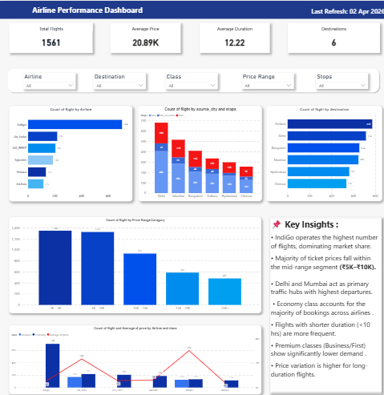
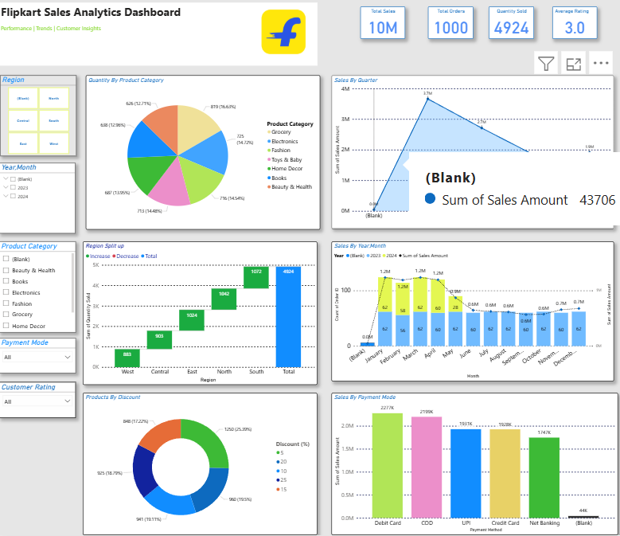

# ✈️ Airline Data Analysis Dashboard

## 🔹 Project Overview
This project analyzes airline performance data to uncover insights related to flight operations, pricing trends, and passenger behavior. The dashboard helps in understanding airline efficiency, demand patterns, and travel trends.

---

## 📊 Problem Statement
The objective of this project is to analyze airline data and identify key factors affecting flight frequency, pricing, and passenger trends to support data-driven decision making.

---

## 🛠️ Tools Used
- Power BI
- Microsoft Excel

---

## 📈 Key Metrics
- Total Flights: 1561
- Average Ticket Price: 20.89K
- Average Duration: 12.22
- Total Destinations: 6

---

## 📊 Key Insights

- IndiGo operates the highest number of flights, dominating the market share.
- Most ticket prices fall within the mid-range segment (₹5K–₹10K).
- Delhi and Mumbai act as major traffic hubs with the highest departures.
- Economy class contributes to the majority of bookings across airlines.
- Flights with shorter durations (<10 hours) are more frequent.
- Premium classes (Business/First) show significantly lower demand.
- Price variation is higher for long-duration flights.

---

## 📌 Dashboard Features
- Interactive filters for Airline, Destination, Class, Price Range, and Stops
- KPI cards for quick performance overview
- Visual comparison of airlines and destinations
- Trend analysis using bar and line charts

---

## 🖼️ Dashboard Preview

---

## 📥 Download Project
[Click here to download](./Airlines_Data_Analysis.pbix)

---

## 🚀 Future Improvements
- Add real-time airline data integration
- Enhance dashboard UI with advanced visuals
- Include predictive analysis for pricing trends

---

## 👤 Author
Sundara Moorthy V 
Aspiring Data Analyst | Power BI | Excel | SQL

---

## 🛒 Flipkart Sales Analytics Dashboard

### 🔹 Project Overview
This project analyzes Flipkart sales data to uncover insights related to revenue trends, product performance, customer behavior, and regional sales distribution. The dashboard provides a comprehensive view of sales performance across multiple dimensions.

---

### 📊 Problem Statement
The objective of this project is to analyze e-commerce sales data and identify key factors influencing revenue, product demand, and customer purchasing patterns.

---

### 🛠️ Tools Used
- Power BI
- Microsoft Excel

---

### 📈 Key Metrics
- Total Sales: 10M
- Total Orders: 1000
- Quantity Sold: 4924
- Average Rating: 3.0

---

### 📊 Key Insights

- Grocery category contributes the highest share of total sales.
- Sales show peak performance in the first quarter, followed by a gradual decline.
- Western and Southern regions generate higher sales compared to other regions.
- Discounts significantly influence product purchases, especially in mid-range discount categories.
- Debit Card and COD are the most preferred payment methods.
- Monthly sales show fluctuations with noticeable drops in mid-year.
- Customer ratings indicate average satisfaction, suggesting scope for improvement.

---

### 📌 Dashboard Features
- Interactive filters for Region, Year/Month, Product Category, Payment Mode, and Customer Rating
- KPI cards for quick overview of business performance
- Category-wise and region-wise analysis
- Time-series analysis of sales trends
- Payment method and discount-based insights

---

### 🖼️ Dashboard Preview

---

### 📥 Download Project
[Click here to download](./Flipkart_Sales.pbix)

---

### 🚀 Future Improvements
- Add customer segmentation analysis
- Improve dashboard UI and interactivity
- Include real-time sales data integration
- Implement predictive analysis for sales forecasting

---
